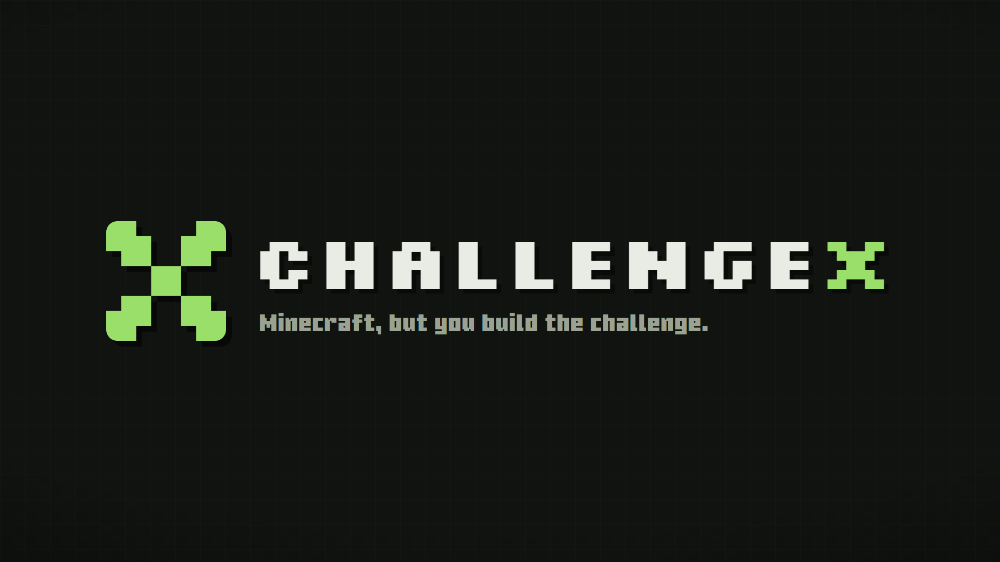

# ChallengeX

Compose your own "Minecraft, but..." challenges from rules, goals, and modifiers to play alone or with your friends. More than 32 million ways to play Minecraft.


## The concept

The "Minecraft, but" genre mostly runs on hand-built challenge lists: someone codes "Minecraft, but taking damage gives a random effect", and that is one challenge.
ChallengeX ships the building blocks instead, and players assemble their own challenge from three independently optional kinds of piece.

- A rule pairs a trigger with an effect, both parametrized (which mob, which status effect, how long, how strong): "when I take damage, I get a random negative effect".
- A goal is the win condition, at most one per challenge: beat the ender dragon, obtain an elytra. A goal can be raced (first to finish wins) or shared (one finish wins for all, or everyone must finish).
- A modifier is a persistent condition in force for the whole run, negative or positive: no crafting table, a 30 minute timer, keep inventory. A challenge can be modifier-only.

The catalog holds 44 triggers, 37 effects, 4 goals, and 12 modifiers. Triggers and effects alone compose into 1,628 distinct rules nobody had to hand-write, before parameters, goals, and modifiers multiply that further.
Rules, effects, and modifiers carry per-player scopes, so asymmetric challenges ("one of us is blind, one is mute") and handicaps for mixed-skill groups are ordinary compositions, not special cases.
The builder never blocks a bad idea: contradictory or unwinnable combinations export happily, by design.
A finished challenge saves as a named preset, a plain JSON file or a shareable link with the preset encoded into it, so a creator can publish a ruleset and viewers can play it.

## Try it

Install the ChallengeX jar into a Fabric Minecraft 26.2 instance's mods folder alongside Fabric API; that covers singleplayer, and on a dedicated server it is a server-side install only.

1. Compose a challenge in the web builder at https://challengexmc.com and download the preset JSON, or hand-write one.
2. Put the file into `config/challengex/presets/`.
3. In-game, `/challengex import` lists the presets as clickable entries; import one, then `/challengex start`.

Runs are controlled with `/challengex pause`, `resume`, and `reset`; mutating commands need op level 2, singleplayer included.
Everything works identically in singleplayer and on a dedicated server, where vanilla clients can join.

## Architecture

The build is three modules around one principle: a platform-agnostic engine with thin adapters.

- `core` - the challenge engine, with no Minecraft or Fabric dependency, unit-tested against fake events.
  - `model` - `Challenge` (a rule multiset, an optional single goal, a modifier list), `Rule` (a trigger spec paired with an effect spec), `Goal`, `Modifier`, and the run clock.
  - `registry` - the four building-block catalogs (triggers, effects, goals, modifiers) with stable namespaced ids and parameter specs.
  - `preset` - the strict, schema-versioned preset codec: a preset carrying an unknown id or a scope mismatch is rejected whole, with every problem named, never partially imported.
  - `engine` - receives abstract game events, matches them against rules, dispatches effect commands, evaluates modifiers and the goal, and advances the run to a win or loss.
- `fabric` - the Fabric adapter, nesting `core` via jar-in-jar.
  - `trigger` - maps Fabric/vanilla server events onto the engine's abstract events; a Mixin fills in only where no event exists.
  - `effect` - executes the engine's effect commands against the server through a handler-per-id map.
  - `modifier` - enforces persistent modifiers per tick, by event cancellation, or by Mixin, depending on what each one needs.
  - `command` - the `/challengex` tree: preset import/reload, run control, and per-player display preferences.
  - `lifecycle` - run clock rendering, pause/resume, win/loss announcements, and per-world run persistence.
  - `export` - generates the website's game-data file from the real game registries.
- `web` - the companion builder site: static, client-side only, no framework, no build step, no runtime dependencies. See `web/README.md`.

An adapter owes the engine five things: feed it game events, execute its effect commands, enforce the modifiers it reports active, drive its tick, and persist its run snapshot.
Everything else an adapter does is platform driver code, which is what keeps a future port (a Paper adapter, an older game version) an adapter-sized job instead of an engine change.

The preset JSON is the contract between the mod and the site: two artifacts in different languages with no compiler between them.
Two things keep it honest. The site renders its forms from `catalog.js`, generated out of `core`'s registries by `:core:exportCatalog`, so the two cannot silently drift; and the site's test suite writes real exports that `core`'s `PresetContractTest` then parses with the mod's actual codec, so the contract is tested from both ends.

## Development

```
./gradlew build
```

Requires Java 25 (via Gradle toolchains).

Checks run from both sides of the JSON contract: `./gradlew :core:test` runs the engine and codec suite, including the contract test that parses the site's committed export fixtures with the mod's real codec, and `node web/test/run.js` runs the site's dependency-free checks and regenerates those fixtures.
`./gradlew :fabric:runServer` boots a headless dedicated server to confirm the mod initializes cleanly.

Two files in `web/assets/js/` are generated, never hand-edited: `catalog.js` (`./gradlew :core:exportCatalog`, rerun after changing a catalog entry) and `gamedata.js` (`./gradlew :fabric:exportGameData`, rerun after a game-version bump).

## Status

Released as v1.0.0, feature-complete and playtested: the engine, the full building-block catalog, the command surface, the run lifecycle with pause and per-world persistence, and the web builder at https://challengexmc.com.
The preset schema and the building-block ids are stable from this release on; presets keep working across updates.
A Paper adapter is planned next.

## Credits

Playtesting: milknowo, KoalaBacon, quinmmn, m0sshy, Crypt1dK1ng, eding_, probsAghost, Phasmi.

## License

[CC BY-NC-SA 4.0](LICENSE), covering the mod and the builder site.
In short: use, share, and modify freely with credit, but don't sell it, and publicly shared modified versions must stay under the same license.
Expressly permitted on top of that: including the unmodified mod in free-to-download modpacks (platforms with creator reward programs included), running it on monetized servers, and featuring it in monetized videos and streams.
The LICENSE file has the full terms.
