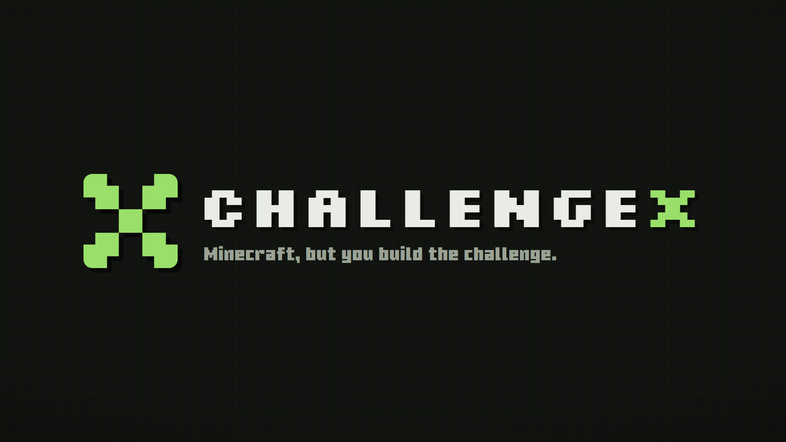

# ChallengeX

Compose your own "Minecraft, but..." challenges from rules and modifiers to play alone or with your friends. More than 500 million ways to play Minecraft.


## The concept

The "Minecraft, but" genre mostly runs on hand-built challenge lists: someone codes "Minecraft, but taking damage gives a random effect", and that is one challenge.
ChallengeX ships the building blocks instead, and players assemble their own challenge from two independently optional kinds of piece.

- A rule pairs a trigger with an effect, both parametrized (which mob, which status effect, how long, how strong): "when I take damage, I get a random negative effect".
- A modifier is a persistent condition in force for the whole run, negative or positive: no jumping, a 30 minute timer, keep inventory. A challenge can be modifier-only.

Winning is composed the same way losing is, as a rule whose effect ends the run: beat the ender dragon, reach the End, survive an hour, hit level 30. Any trigger in the catalog can be a win condition, a challenge can carry several, and each one chooses whether the first finish ends the run or everybody has to finish.

The catalog holds 44 triggers, 38 effects, and 19 modifiers. Triggers and effects alone compose into 1,672 distinct rules nobody had to hand-write, before parameters and modifiers multiply that further.
Triggers, effects, and modifiers carry per-player scopes, so asymmetric challenges ("one of us is blind, one is mute"), handicaps for mixed-skill groups, and races between players are ordinary compositions, not special cases.
The builder never blocks a bad idea: contradictory or unwinnable combinations export happily, by design.
A finished challenge saves as a named preset, a plain JSON file or a shareable link with the preset encoded into it, so a creator can publish a ruleset and viewers can play it.

## Try it

Install the ChallengeX jar into a Fabric Minecraft 26.2 instance's mods folder alongside Fabric API; that covers singleplayer, and on a dedicated server it is a server-side install only.

1. Compose a challenge in the web builder at https://challengexmc.com and download the preset JSON, or hand-write one.
2. Put the file into `config/challengex/presets/`.
3. In-game, `/challengex import` lists the presets as clickable entries; import one, then `/challengex start`.

Runs are controlled with `/challengex pause`, `resume`, and `reset`; mutating commands need op level 2, singleplayer included.
Everything works identically in singleplayer and on a dedicated server, where vanilla clients can join.

## Architecture

The build is five modules around one principle: a platform-agnostic engine with thin adapters.

- `core` - the challenge engine, with no Minecraft or Fabric dependency, unit-tested against fake events.
  - `model` - `Challenge` (a rule multiset and a modifier list), `Rule` (a trigger spec paired with an effect spec), `Modifier`, and the run clock.
  - `registry` - the three building-block catalogs (triggers, effects, modifiers) with stable namespaced ids and parameter specs.
  - `preset` - the strict, schema-versioned preset codec: a preset carrying an unknown id or a scope mismatch is rejected whole, with every problem named, never partially imported.
  - `engine` - receives abstract game events, matches them against rules, dispatches effect commands, evaluates modifiers, tracks who is still in the run, and settles it to a win or loss.
- `common` - the adapter logic that is platform-neutral but is not engine: run clock formatting, the timer colour ramps and their sampling, run and preset file I/O, the finished-run announcement, the challenge summary, shared-pool arithmetic, and the per-platform support declaration. It carries no Minecraft dependency either, so all of it is unit-tested. The line it draws is that deciding what to say is shared while drawing it is not: shared code hands back a `StyledLine` and each adapter turns that into its own platform's text type.
- `fabric` - the Fabric adapter, nesting `core` and `common` via jar-in-jar.
  - `trigger` - maps Fabric/vanilla server events onto the engine's abstract events; a Mixin fills in only where no event exists.
  - `effect` - executes the engine's effect commands against the server through a handler-per-id map.
  - `modifier` - enforces persistent modifiers per tick, by event cancellation, or by Mixin, depending on what each one needs.
  - `command` - the `/challengex` tree: preset import/reload, run control, and per-player display preferences.
  - `lifecycle` - run clock rendering, pause/resume, win/loss announcements, and per-world run persistence.
  - `export` - generates the website's game-data file from the real game registries.
- `paper` - the Paper adapter, packaging `core` and `common` as plain classes since Bukkit has no jar-in-jar. The same shape as the Fabric one against the Bukkit event model, and with no Mixins: a cancellable event is what most of this needs, and Paper has real events for nearly everything Fabric had to weave into vanilla classes.
- `web` - the companion builder site: static, client-side only, no framework, no build step, no runtime dependencies. See `web/README.md`.

An adapter owes the engine five things: feed it game events, execute its effect commands, enforce the modifiers it reports active, drive its tick, and persist its run snapshot.
Everything else an adapter does is platform driver code, which is what kept the Paper port an adapter-sized job with no engine change, and what would keep an older game version the same.

The two adapters do not run quite the same catalog, and the difference is declared in one place (`PlatformSupport` in `common`) rather than left to be discovered in play.
Preset validation cannot catch it, since `core` is shared and an id only one adapter sources is a known id everywhere, so a preset using it imports clean on both.
An adapter therefore names the gap when a preset is imported, the builder marks the pieces that will not travel, and the share page says so in one line.
Today that difference is one modifier.

The preset JSON is the contract between the mod and the site: two artifacts in different languages with no compiler between them.
Two things keep it honest. The site renders its forms from `catalog.js`, generated out of `core`'s registries by `:core:exportCatalog`, so the two cannot silently drift; and the site's test suite writes real exports that `core`'s `PresetContractTest` then parses with the mod's actual codec, so the contract is tested from both ends.

## Development

```
./gradlew build
```

Requires Java 25 (via Gradle toolchains).

Checks run from both sides of the JSON contract: `./gradlew :core:test` runs the engine and codec suite, including the contract test that parses the site's committed export fixtures with the mod's real codec, and `node web/test/run.js` runs the site's dependency-free checks and regenerates those fixtures.
`./gradlew :common:test` covers the shared adapter logic, and `./gradlew :paper:test` holds each adapter's registration tables to the catalog, so an entry nobody wired fails the build rather than silently doing nothing in play.
`./gradlew :fabric:runServer` boots a headless dedicated server to confirm the mod initializes cleanly; the plugin is checked by dropping its jar into a Paper server's `plugins/` folder.

Three files in `web/assets/js/` are generated, never hand-edited: `catalog.js` (`./gradlew :core:exportCatalog`, rerun after changing a catalog entry), `gamedata.js` (`./gradlew :fabric:exportGameData`, rerun after a game-version bump), and `support.js` (`./gradlew :common:exportSupport`, rerun after changing what a platform runs).

## Status

Released as v2.1.0 on Fabric and Paper, feature-complete and playtested: the engine, the full building-block catalog, the command surface, the run lifecycle with pause and per-world persistence, and the web builder at https://challengexmc.com.

The Paper adapter runs the whole catalog bar one modifier: the shared inventory, which Fabric implements by pointing every member's inventory at a single object through a Mixin, and which Bukkit gives no way to express without copying inventories every tick and inviting the duplication a shared inventory must not have. Cut rather than hacked. Everything else is there, pause and per-world persistence included.

v2.0.0 replaces goals with win conditions composed as rules, which is what makes it a major version: the preset schema moves to version 2 and a version 1 preset is rejected rather than silently losing its win condition, so a challenge built before this release has to be rebuilt in the builder.
Every player now wins or loses on their own, with the run ending on the first finish or once everybody is done, and a finish announces its place and time.
Seven modifiers arrive with it: shared health, hunger and experience, randomized crafting, no dropping, no picking up, and an item lock that gives whatever one player carries to them alone.

## License

[CC BY-NC-SA 4.0](LICENSE), covering the mod and the builder site.
In short: use, share, and modify freely with credit, but don't sell it, and publicly shared modified versions must stay under the same license.
Expressly permitted on top of that: including the unmodified mod in free-to-download modpacks (platforms with creator reward programs included), running it on monetized servers, and featuring it in monetized videos and streams.
The LICENSE file has the full terms.
